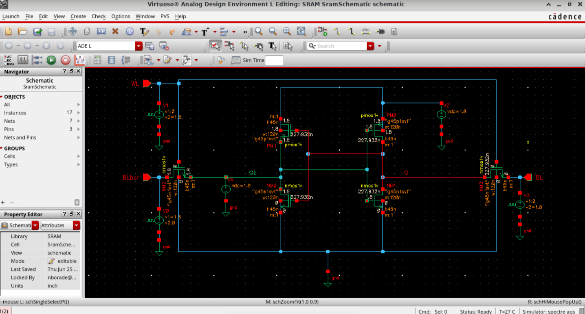

# 🚀 6T SRAM Cell: DC Analysis & Characterization

This repository contains the design, simulation, and DC stability characterization of a standard **6-Transistor (6T) SRAM cell** implemented using Cadence Virtuoso. The project focuses on mapping out the cell's Voltage Transfer Characteristics (VTC) to evaluate static stability.

---

## 📌 Project Overview
Static Random-Access Memory (SRAM) is a critical pillar of modern high-speed cache architectures. A standard 6T SRAM cell utilizes two cross-coupled CMOS inverters to store a single bit of data, isolated or accessed via two control NMOS pass-transistors. Analyzing the DC performance is a fundamental step to understanding the cell's immunity to noise during hold and read operations.

---

## 🛠️ Circuit Design & Specifications

The schematic was designed using the **GPDK 45nm CMOS technology node** (`g45n1svt`) with a supply voltage ($V_{DD}$) of **1.8V**. All transistors are sized for a balanced layout profile.

| Transistor Name | Type | Function | Width ($W$) | Length ($L$) | Model |
| :--- | :--- | :--- | :--- | :--- | :--- |
| **PM0, PM1** | PMOS | Pull-Up (Load) | 120 nm | 45 nm | `g45n1svt` |
| **NM0, NM1** | NMOS | Pull-Down (Driver) | 120 nm | 45 nm | `g45n1svt` |
| **NM2, NM3** | NMOS | Access (Pass-Gate)| 120 nm | 45 nm | `g45n1svt` |

### 🔍 Schematic Capture
An independent DC voltage source (`V4`) was intentionally tied to the internal storage node `Qb` to break the feedback loop and execute a precise voltage sweep for stability characterization.

---

## 💻 Simulation Setup (ADE L)

The simulation was configured and executed using the **Cadence Analog Design Environment L (ADE L)** engine with the Spectre simulator:

* **Analysis Type:** DC Sweep
* **Sweep Variable:** Component Parameter (`Voltage Source /V4` connected to node `Qb`)
* **Sweep Range:** $0\text{V} \rightarrow 1.8\text{V}$ (Linear)
* **Monitored Outputs:** Internal complementary storage nodes `Q` and `Qb`

---

## 📊 Results & Analysis

Waveforms were analyzed using **Virtuoso Visualization & Analysis XL**. 

* 🔴 **Node Qb Response (Red Curve):** Tracks the cross-coupled inverter feedback behavior.
* 🔵 **Node Q Response (Cyan Curve):** Demonstrates a sharp inverter switching threshold (trip point) occurring precisely around **~0.85V**.
* 🟢 **Linear Sweep Reference (Green Curve):** Represents the independent sweep voltage input (`/Qb`).

The intersection of these Voltage Transfer Characteristics (VTC) yields the foundational plotting behavior required to calculate the **Static Noise Margin (SNM)** via the classic "butterfly curve" method.

---

## 🧰 Tools & Environment
* **EDA Tool suite:** Cadence Virtuoso (IC6.1.X)
* **Schematic Capture:** Virtuoso Schematic Editor
* **Simulation Engine:** ADE L (Spectre)
* **Waveform Viewer:** Virtuoso Visualization & Analysis XL
