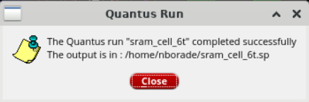

# Cadence Virtuoso 6T SRAM Design and Verification

This repository contains the complete custom IC design flow for a 6-Transistor (6T) SRAM architecture, designed in Cadence Virtuoso. This documentation covers the full design cycle, from transistor-level schematic capture to physical layout and post-layout verification.

## Project Hierarchy

### 1. Schematic Design & Symbols
The core 6T SRAM cell is supported by peripheral circuitry, including precharge logic, sense amplifiers, and row decoders.

*   **Core 6T SRAM:**  | 
*   **Sense Amplifier:**  | 
*   **Precharge Circuit:**  | 
*   **Row Decoder:**  | 

### 2. Array Integration
The components are integrated into an 8-bit column and finally an 8x8 array.

*   **8-Bit Column:**  | 
*   **8x8 Array:**  | 
*   **System Testbench:** 

## Verification & Analysis

### Transient Analysis
Transient simulation verifies the read/write functionality of the system over time.

### Layout & Physical Verification
The 6T cell was laid out with attention to area and parasitic mitigation. Verification included DRC and LVS checks using Cadence PVS.
*   **Layout:**  | 
*   **DRC:** 
*   **LVS:**  | 

### Parasitic Extraction (PEX)
RC parasitics were extracted using Quantus QRC for accurate post-layout simulation.
*   **Setup:** 
*   **Run Details:** 
*   **Success:** 

---

## Technical Stack
*   **Schematic/Symbol:** Cadence Virtuoso Schematic Editor
*   **Simulation:** ADE L / Virtuoso Visualization & Analysis XL
*   **Physical Design:** Virtuoso Layout Suite
*   **Verification:** Cadence PVS (DRC/LVS)
*   **Extraction:** Quantus QRC
